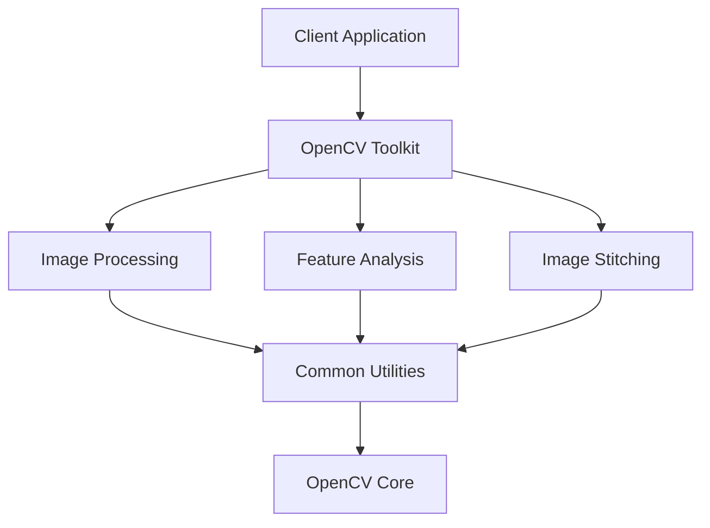
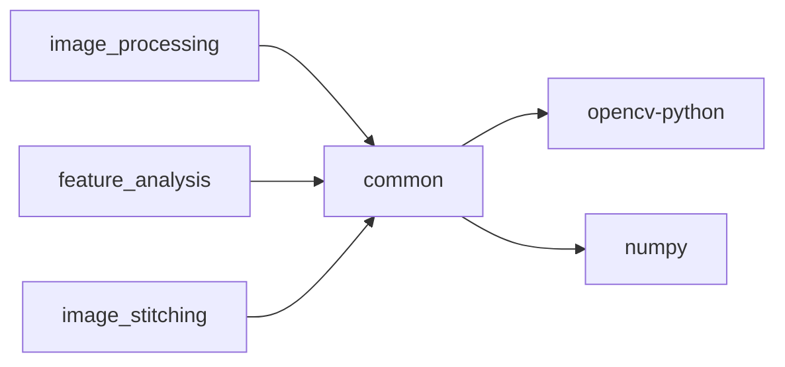
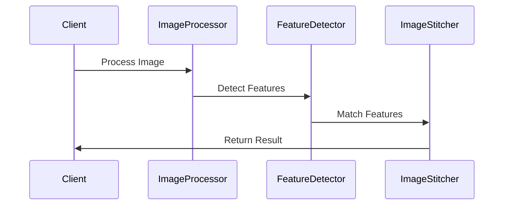
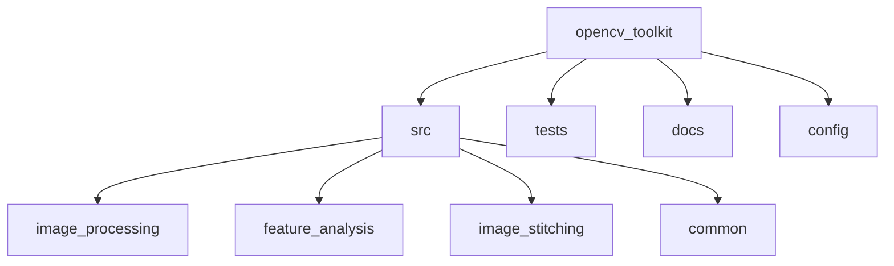

# OpenCV Toolkit Architecture

## High-Level Architecture

```mermaid
graph TD
    A[Client Application] --> B[OpenCV Toolkit]
    B --> C[Image Processing]
    B --> D[Feature Analysis]
    B --> E[Image Stitching]
    C --> F[Common Utilities]
    D --> F
    E --> F
    F --> G[OpenCV Core]
```

## Module Dependencies

```mermaid
graph LR
    A[image_processing] --> D[common]
    B[feature_analysis] --> D
    C[image_stitching] --> D
    D --> E[opencv-python]
    D --> F[numpy]
```

## Data Flow

```mermaid
graph LR
    A[Input] --> B[Preprocessing]
    B --> C[Feature Detection]
    C --> D[Feature Matching]
    D --> E[Image Stitching]
    E --> F[Output]
```

## Component Interaction

```mermaid
sequenceDiagram
    participant Client
    participant ImageProcessor
    participant FeatureDetector
    participant ImageStitcher
    
    Client->>ImageProcessor: Process Image
    ImageProcessor->>FeatureDetector: Detect Features
    FeatureDetector->>ImageStitcher: Match Features
    ImageStitcher->>Client: Return Result
```

## Directory Structure

```mermaid
graph TD
    A[opencv_toolkit] --> B[src]
    A --> C[tests]
    A --> D[docs]
    A --> E[config]
    B --> F[image_processing]
    B --> G[feature_analysis]
    B --> H[image_stitching]
    B --> I[common]
```
